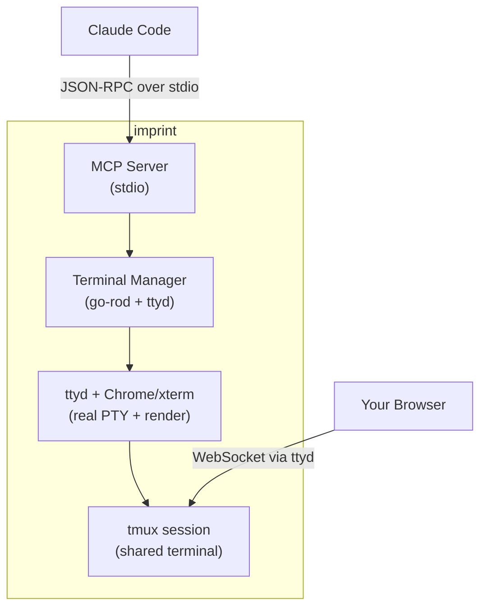

# Imprint Implementation Plan

**Goal**: Build an agent-controllable terminal emulator with MCP server interface. Agents can request a screenshot of the terminal at any time, giving them pixel-perfect visibility into exactly what a user would see.

This lets agents test like real users do—interacting with the terminal and seeing what's actually on screen, regardless of how the app was built. TUI testing becomes framework-agnostic, allowing you to test any terminal application without needing to learn or use its internal testing strategies.

## Architecture

Imprint uses a headless browser approach for pixel-perfect terminal rendering:
- **ttyd**: Web terminal daemon that exposes a real PTY via WebSocket
- **tmux**: Terminal multiplexer enabling session sharing (AI + user browser see same terminal)
- **go-rod**: Headless Chrome automation for keyboard input + screenshots
- **xterm.js**: Terminal emulator running in Chrome (renders the PTY)



## Interface

### MCP Server (stdio)
Tools exposed to AI agents:
- `send_keystrokes` - Send key presses (batch)
- `type_text` - Type a string
- `get_screenshot` - Get screen as base64 JPEG
- `get_screen_text` - Get screen as plain text
- `get_status` - Get terminal status
- `get_ttyd_url` - Get URL to view terminal in browser (same session as AI)
- `resize_terminal` - Resize the terminal
- `restart_terminal` - Restart with optional new command
- `wait_for_text` - Wait for text to appear (polling)
- `wait_for_stable` - Wait for screen to stop changing

## Dependencies

**External (must be installed):**
- ttyd (terminal sharing daemon)
- tmux (terminal multiplexer for session sharing)
- Chrome/Chromium (auto-downloaded by go-rod)

**Go dependencies:**
```go
require (
    github.com/go-rod/rod v0.116.x      // Browser automation
    github.com/mark3labs/mcp-go v0.x.x  // MCP server library
)
```

## Project Structure

```
imprint/
├── cmd/
│   └── imprint/
│       └── main.go           # CLI entry point
├── internal/
│   ├── terminal/
│   │   └── terminal.go       # Terminal manager (ttyd + tmux + go-rod)
│   └── mcp/
│       └── server.go         # MCP server + tools
├── examples/
│   ├── screenshot-demo/      # Visual TUI demo (colors, visual bugs)
│   ├── text-demo/            # Simple text-based TUI
│   └── what-changed/         # Visual memory game
├── go.mod
├── go.sum
├── install.sh                # Installation script (imprint, ttyd, tmux)
├── LICENSE                   # Apache 2.0
├── README.md
└── PLAN.md
```

---

## Implementation Phases

### Phase 1: Project Setup
**Files**: `go.mod`, `cmd/imprint/main.go`

1. Initialize Go module: `github.com/kessler-frost/imprint`
2. Add dependencies (go-rod, mcp-go)
3. Create CLI with flags:
   - `--shell` (default: $SHELL)
   - `--rows` (default: 24)
   - `--cols` (default: 80)
   - `--version`

---

### Phase 2: Terminal Manager
**Files**: `internal/terminal/terminal.go`

Core terminal control using ttyd + go-rod:

```go
type Terminal struct {
    browser     *rod.Browser
    page        *rod.Page
    cmd         *exec.Cmd  // ttyd process
    port        int
    rows        int
    cols        int
    mu          sync.RWMutex
    tmuxSession string     // Unique tmux session name for session sharing
}

func New(shell string, rows, cols int) (*Terminal, error)
func (t *Terminal) Start() error
func (t *Terminal) SendKeys(keys []string) error   // Batch key presses
func (t *Terminal) Type(text string) error         // Type string
func (t *Terminal) Screenshot(quality int) ([]byte, error)  // JPEG bytes
func (t *Terminal) GetText() (string, error)       // Screen as text
func (t *Terminal) Resize(rows, cols int) error
func (t *Terminal) Restart(command string) error
func (t *Terminal) WaitForText(text string, timeoutMs int) (int, bool, error)
func (t *Terminal) WaitForStable(timeoutMs, stableMs int) (int, bool, error)
func (t *Terminal) GetTtydUrl() string
func (t *Terminal) Close() error
```

**Key implementation details:**
- Start ttyd with: `ttyd --port {port} --interface 127.0.0.1 --writable tmux new-session -A -s {session} {shell}`
- The `-A` flag attaches to existing tmux session or creates new one, enabling session sharing
- Connect go-rod browser to `http://127.0.0.1:{port}`
- Use `page.Keyboard.Press()` for special keys
- Use `page.MustElement("textarea").Input()` for text
- Use `page.Screenshot()` for capture (JPEG format)
- Extract text via JavaScript eval on xterm.js buffer
- Users can view the same terminal session in browser via `GetTtydUrl()`

---

### Phase 3: MCP Server
**Files**: `internal/mcp/server.go`

MCP server using stdio transport:

```go
type Server struct {
    term   *terminal.Terminal
}

func New(term *terminal.Terminal) *Server
func (s *Server) Start() error  // Blocks on stdio

// Tools registered with MCP:
// - send_keystrokes(keys: []string)
// - type_text(text: string)
// - get_screenshot(quality?: int) -> base64 JPEG
// - get_screen_text() -> string
// - get_status() -> {rows, cols, ready}
// - get_ttyd_url() -> string (URL to view terminal in browser)
// - resize_terminal(rows: int, cols: int)
// - restart_terminal(command?: string)
// - wait_for_text(text: string, timeout_ms?: int) -> {elapsed_ms, found}
// - wait_for_stable(timeout_ms?: int, stable_ms?: int) -> {elapsed_ms, stable}
```

---

### Phase 4: CLI Integration
**Files**: `cmd/imprint/main.go`

Wire everything together:

```go
func main() {
    shell := flag.String("shell", os.Getenv("SHELL"), "Shell to run")
    rows := flag.Int("rows", 24, "Terminal rows")
    cols := flag.Int("cols", 80, "Terminal columns")
    version := flag.Bool("version", false, "Print version and exit")

    term, _ := terminal.New(*shell, *rows, *cols)
    term.Start()
    defer term.Close()

    mcpServer := mcp.New(term)
    mcpServer.Start()  // Blocks on stdio
}
```

---

## Key Mappings

```go
var keyMap = map[string]input.Key{
    "enter":     input.Enter,
    "backspace": input.Backspace,
    "tab":       input.Tab,
    "escape":    input.Escape,
    "up":        input.ArrowUp,
    "down":      input.ArrowDown,
    "left":      input.ArrowLeft,
    "right":     input.ArrowRight,
    "space":     input.Space,
    "delete":    input.Delete,
    "home":      input.Home,
    "end":       input.End,
    "pageup":    input.PageUp,
    "pagedown":  input.PageDown,
    "f1":        input.F1,
    // ... etc
}

// Modifier combinations:
// "ctrl+c" → Press(ControlLeft), Type("c"), Release(ControlLeft)
// "alt+f"  → Press(AltLeft), Type("f"), Release(AltLeft)
```

---

## MCP Configuration (Claude Code)

Add imprint as an MCP server:

```bash
claude mcp add imprint -- ~/.local/bin/imprint
```

With custom terminal size:

```bash
claude mcp add imprint -- ~/.local/bin/imprint --rows 30 --cols 120
```

---

## Usage Examples

### MCP (Claude Code)
```
User: Run ls in the terminal and show me the output
Claude: [Uses type_text, send_keystrokes, and get_screenshot tools automatically]
```

---

## Success Criteria for v1

1. `imprint` starts terminal + MCP server
2. MCP: Tools appear in Claude Code
3. MCP: Can send keystrokes and type text
4. MCP: Can capture screenshots and screen text
5. MCP: Can resize and restart terminal
6. MCP: wait_for_text and wait_for_stable work correctly

---

## Installation

```bash
# Easy install (downloads imprint, installs ttyd and tmux)
curl -fsSL https://raw.githubusercontent.com/kessler-frost/imprint/main/install.sh | sh

# Or manual installation:
# Install dependencies (macOS)
brew install ttyd tmux

# Install imprint
go install github.com/kessler-frost/imprint/cmd/imprint@latest

# Run (launched by Claude Code via MCP)
imprint
```

---

## Future Enhancements (Post-v1)

### TUI Testing Tools (High Priority)

- **Screenshot diffing** - Compare current screen against a baseline image. Returns diff percentage and highlighted diff image for visual regression testing.

- **Mouse support** - Enable mouse interactions for modern TUIs:
  - `click(x, y)` - Click at coordinates
  - `scroll(direction, amount)` - Scroll up/down
  - `drag(from_x, from_y, to_x, to_y)` - Drag operations

### TUI Testing Tools (Medium Priority)

- **`get_cursor_position` tool** - Return current cursor row/col. Useful for verifying cursor placement in editors and input fields.

- **Clipboard support** - `set_clipboard(text)` and `get_clipboard()` for testing copy/paste workflows.

- **Text region extraction** - `get_text_region(row_start, col_start, row_end, col_end)` to extract text from specific screen areas.

- **ANSI color extraction** - Option to return text with color/style metadata (foreground, background, bold, etc.) for testing color schemes and themes.

- **Recording mode** - Record all inputs and screenshots during a session for replay or test script generation:
  - `start_recording()` → session_id
  - `stop_recording(session_id)` → {inputs: [...], screenshots: [...]}

### TUI Testing Tools (Nice-to-Have)

- **Built-in assertion helpers** - Structured pass/fail assertions in MCP:
  - `assert_text_contains("Success")` → {passed: true}
  - `assert_text_matches(/Error: \d+/)` → {passed: false, actual: "..."}

- **Environment variable injection** - Pass env vars to terminal process for testing different configurations without restart.

- **Test fixtures/scenarios** - Built-in commands to set up common TUI states (scrollable list, form with inputs, etc.).

### Core Improvements (High Priority)

- **Comprehensive tests** - Add thorough test coverage including:
  - Unit tests for key mapping logic and text extraction
  - Integration tests for MCP handlers
  - End-to-end tests for terminal operations
  - Session sharing verification tests

- **Graceful error handling** - Replace panic-prone `Must*()` calls with proper error returns. Improves reliability.

- **Configurable timing** - Make ttyd startup wait time configurable via flag/env var instead of hard-coded 500ms.

### Core Improvements (Medium Priority)

- **Structured logging** - Add log levels (debug, info, warn, error) to help diagnose issues.

- **Multiple terminal sessions** - Support multiple concurrent terminal instances for parallel test execution.

### Platform & Infrastructure

- ~~**Stream terminal in browser**~~ - ✅ IMPLEMENTED via tmux session sharing and `get_ttyd_url` tool. Users can watch AI control the terminal in real-time.
