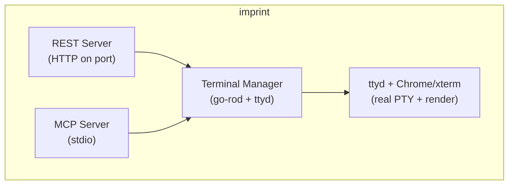

# Imprint Implementation Plan

**Goal**: Build an agent-controllable terminal emulator with both REST API and MCP server interfaces. Agents can request a screenshot of the terminal at any time, giving them pixel-perfect visibility into exactly what a user would see.

This lets agents test like real users do—interacting with the terminal and seeing what's actually on screen, regardless of how the app was built. TUI testing becomes framework-agnostic, allowing you to test any terminal application without needing to learn or use its internal testing strategies.

## Architecture

Imprint uses a headless browser approach for pixel-perfect terminal rendering:
- **ttyd**: Web terminal daemon that exposes a real PTY via WebSocket
- **go-rod**: Headless Chrome automation for keyboard input + screenshots
- **xterm.js**: Terminal emulator running in Chrome (renders the PTY)



## Interfaces

### REST API (HTTP)
```
POST /keystroke    - Send single key (enter, ctrl+c, etc)
POST /type         - Type string of characters
GET  /screen       - Get current screen as PNG
GET  /screen/text  - Get current screen as text
GET  /status       - Terminal status (size, cursor)
POST /resize       - Resize terminal
```

### MCP Server (stdio)
Tools exposed to AI agents:
- `send_keystroke` - Send a key press
- `type_text` - Type a string
- `get_screenshot` - Get screen as base64 PNG
- `get_screen_text` - Get screen as plain text
- `get_status` - Get terminal status
- `resize_terminal` - Resize the terminal

## Dependencies

**External (must be installed):**
- ttyd (terminal sharing daemon)
- Chrome/Chromium (auto-downloaded by go-rod)

**Go dependencies:**
```go
require (
    github.com/go-rod/rod v0.116.x      // Browser automation
    github.com/mark3labs/mcp-go v0.x.x  // MCP server library
)
```

## Project Structure

```
imprint/
├── cmd/
│   └── imprint/
│       └── main.go           # CLI entry point
├── internal/
│   ├── terminal/
│   │   └── terminal.go       # Terminal manager (ttyd + go-rod)
│   ├── rest/
│   │   ├── server.go         # HTTP server
│   │   └── handlers.go       # REST handlers
│   └── mcp/
│       └── server.go         # MCP server + tools
├── go.mod
├── go.sum
├── LICENSE                   # Apache 2.0
├── README.md
└── PLAN.md
```

---

## Implementation Phases

### Phase 1: Project Setup ✅
**Files**: `go.mod`, `cmd/imprint/main.go`

1. Initialize Go module: `github.com/kessler-frost/imprint`
2. Add dependencies (go-rod, mcp-go)
3. Create CLI with flags:
   - `--port` (default: 8080) - REST API port
   - `--shell` (default: $SHELL)
   - `--rows` (default: 24)
   - `--cols` (default: 80)

---

### Phase 2: Terminal Manager ✅
**Files**: `internal/terminal/terminal.go`

Core terminal control using ttyd + go-rod:

```go
type Terminal struct {
    browser *rod.Browser
    page    *rod.Page
    cmd     *exec.Cmd  // ttyd process
    port    int
    rows    int
    cols    int
}

func New(shell string, rows, cols int) (*Terminal, error)
func (t *Terminal) Start() error
func (t *Terminal) SendKey(key string) error      // "enter", "ctrl+c", "a"
func (t *Terminal) Type(text string) error        // Type string
func (t *Terminal) Screenshot() ([]byte, error)   // PNG bytes
func (t *Terminal) GetText() (string, error)      // Screen as text
func (t *Terminal) Resize(rows, cols int) error
func (t *Terminal) Close() error
```

**Key implementation details:**
- Start ttyd with: `ttyd --port {port} --interface 127.0.0.1 --once {shell}`
- Connect go-rod browser to `http://127.0.0.1:{port}`
- Use `page.Keyboard.Press()` for special keys
- Use `page.MustElement("textarea").Input()` for text
- Use `page.Screenshot()` for PNG capture
- Extract text via JavaScript eval on xterm.js buffer

---

### Phase 3: REST Server ✅
**Files**: `internal/rest/server.go`, `internal/rest/handlers.go`

HTTP REST API implementation:

```go
type Server struct {
    term *terminal.Terminal
    port int
}

func New(term *terminal.Terminal, port int) *Server
func (s *Server) Start() error

// Handlers
func (s *Server) HandleKeystroke(w http.ResponseWriter, r *http.Request)
func (s *Server) HandleType(w http.ResponseWriter, r *http.Request)
func (s *Server) HandleScreen(w http.ResponseWriter, r *http.Request)
func (s *Server) HandleScreenText(w http.ResponseWriter, r *http.Request)
func (s *Server) HandleStatus(w http.ResponseWriter, r *http.Request)
func (s *Server) HandleResize(w http.ResponseWriter, r *http.Request)
```

---

### Phase 4: MCP Server ✅
**Files**: `internal/mcp/server.go`

MCP server using stdio transport:

```go
type MCPServer struct {
    term   *terminal.Terminal
    server *mcp.Server
}

func New(term *terminal.Terminal) *MCPServer
func (m *MCPServer) Start() error  // Blocks on stdio

// Tools registered with MCP:
// - send_keystroke(key: string)
// - type_text(text: string)
// - get_screenshot() -> base64 PNG
// - get_screen_text() -> string
// - get_status() -> {rows, cols, ready}
// - resize_terminal(rows: int, cols: int)
```

---

### Phase 5: CLI Integration ✅
**Files**: `cmd/imprint/main.go`

Wire everything together, run both servers:

```go
func main() {
    // Parse flags
    port := flag.Int("port", 8080, "REST API port")
    shell := flag.String("shell", os.Getenv("SHELL"), "Shell to run")
    rows := flag.Int("rows", 24, "Terminal rows")
    cols := flag.Int("cols", 80, "Terminal columns")

    // Create terminal
    term, _ := terminal.New(*shell, *rows, *cols)
    term.Start()

    // Start REST server (goroutine)
    restServer := rest.New(term, *port)
    go restServer.Start()

    // Start MCP server (blocks on stdio)
    mcpServer := mcp.New(term)
    mcpServer.Start()
}
```

---

## Key Mappings

```go
var keyMap = map[string]input.Key{
    "enter":     input.Enter,
    "backspace": input.Backspace,
    "tab":       input.Tab,
    "escape":    input.Escape,
    "up":        input.ArrowUp,
    "down":      input.ArrowDown,
    "left":      input.ArrowLeft,
    "right":     input.ArrowRight,
    "space":     input.Space,
    "delete":    input.Delete,
    "home":      input.Home,
    "end":       input.End,
    "pageup":    input.PageUp,
    "pagedown":  input.PageDown,
    "f1":        input.F1,
    // ... etc
}

// Modifier combinations:
// "ctrl+c" → Press(ControlLeft), Type("c"), Release(ControlLeft)
// "alt+f"  → Press(AltLeft), Type("f"), Release(AltLeft)
```

---

## MCP Configuration (Claude Code)

Users add to `.mcp.json`:

```json
{
  "mcpServers": {
    "imprint": {
      "command": "imprint",
      "args": ["--port", "8080"]
    }
  }
}
```

Then AI agents can use the terminal tools directly.

---

## API Usage Examples

### REST (Python)
```python
import requests

requests.post("http://localhost:8080/type", json={"text": "ls -la"})
requests.post("http://localhost:8080/keystroke", json={"key": "enter"})
screen = requests.get("http://localhost:8080/screen").content  # PNG
```

### MCP (Claude Code)
```
User: Run ls in the terminal and show me the output
Claude: [Uses send_keystroke and get_screenshot tools automatically]
```

---

## Success Criteria for v1

1. `imprint` starts terminal + REST server + MCP server
2. REST: `GET /screen` returns valid PNG
3. REST: `POST /keystroke` and `/type` work
4. MCP: Tools appear in Claude Code
5. MCP: Can run commands and see screenshots in Claude Code
6. Both interfaces control the same terminal session

---

## Installation

```bash
# Install dependencies (macOS)
brew install ttyd

# Install imprint
go install github.com/kessler-frost/imprint/cmd/imprint@latest

# Run
imprint --port 8080
```

---

## Future Enhancements (Post-v1)

### TUI Testing Tools (High Priority)

- **`wait_for_text` tool** - Block until specific text appears on screen with configurable timeout. Eliminates fragile sleep-based timing in test scripts.

- **`wait_for_stable` tool** - Wait until the screen stops changing. Essential for handling animations, async rendering, and loading states.

- **Screenshot diffing** - Compare current screen against a baseline image. Returns diff percentage and highlighted diff image for visual regression testing.

- **Mouse support** - Enable mouse interactions for modern TUIs:
  - `click(x, y)` - Click at coordinates
  - `scroll(direction, amount)` - Scroll up/down
  - `drag(from_x, from_y, to_x, to_y)` - Drag operations

### TUI Testing Tools (Medium Priority)

- **`get_cursor_position` tool** - Return current cursor row/col. Useful for verifying cursor placement in editors and input fields.

- **Clipboard support** - `set_clipboard(text)` and `get_clipboard()` for testing copy/paste workflows.

- **Text region extraction** - `get_text_region(row_start, col_start, row_end, col_end)` to extract text from specific screen areas.

- **ANSI color extraction** - Option to return text with color/style metadata (foreground, background, bold, etc.) for testing color schemes and themes.

- **Recording mode** - Record all inputs and screenshots during a session for replay or test script generation:
  - `start_recording()` → session_id
  - `stop_recording(session_id)` → {inputs: [...], screenshots: [...]}

### TUI Testing Tools (Nice-to-Have)

- **Built-in assertion helpers** - Structured pass/fail assertions in MCP:
  - `assert_text_contains("Success")` → {passed: true}
  - `assert_text_matches(/Error: \d+/)` → {passed: false, actual: "..."}

- **Environment variable injection** - Pass env vars to terminal process for testing different configurations without restart.

- **Test fixtures/scenarios** - Built-in commands to set up common TUI states (scrollable list, form with inputs, etc.).

### Core Improvements (High Priority)

- **Concurrency safety** - Add mutex synchronization around terminal operations. Both REST and MCP servers share the same Terminal instance without coordination.

- **Graceful error handling** - Replace panic-prone `Must*()` calls with proper error returns. Improves reliability in long-running daemon mode.

- **Unit tests** - Add test coverage for key mapping logic, text extraction, and REST handlers.

- **Configurable timing** - Make ttyd startup wait time configurable via flag/env var instead of hard-coded 500ms.

### Core Improvements (Medium Priority)

- **Health endpoint** - Add `/health` or `/ready` endpoint for orchestration and monitoring.

- **Structured logging** - Add log levels (debug, info, warn, error) to help diagnose production issues.

- **Multiple terminal sessions** - Support multiple concurrent terminal instances for parallel test execution.

### Platform & Infrastructure

- **Stream terminal in browser** - Web-based terminal viewer for debugging and demos.

- **Linux/Windows support improvements** - Better cross-platform compatibility, especially for daemon mode.

- **Configurable screenshot format** - Allow choosing between JPEG (smaller) and PNG (lossless) per request.
