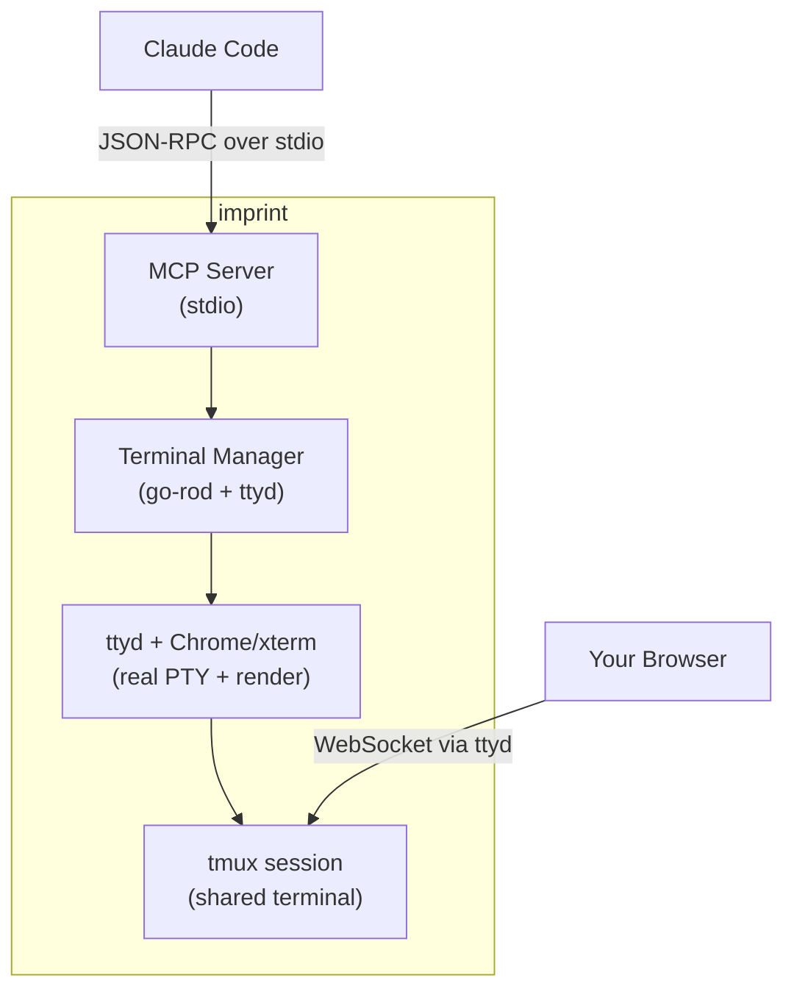

<h1 align="center">imprint</h1>

<p align="center">
  <a href="https://pkg.go.dev/github.com/kessler-frost/imprint"></a>
  <a href="https://goreportcard.com/report/github.com/kessler-frost/imprint"></a>
  <a href="LICENSE"></a>
  <a href="https://github.com/kessler-frost/imprint/releases"></a>
</p>

<p align="center">
  
</p>

<p align="center">
  <em>Lets AI agents control a terminal and see what's on screen via MCP, allowing precise TUI testing.</em>
</p>

## Overview

Imprint provides a real terminal that AI agents can control programmatically. Agents can request a screenshot of the terminal at any time, giving them pixel-perfect visibility into exactly what a user would see.

This lets agents test like real users do—interacting with the terminal and seeing what's actually on screen, regardless of how the app was built. TUI testing becomes framework-agnostic, allowing you to test any terminal application without needing to learn or use its internal testing strategies.

**How it works:**
- **ttyd**: Web terminal daemon exposing a real PTY via WebSocket
- **tmux**: Terminal multiplexer enabling session sharing between AI and user
- **go-rod**: Headless Chrome automation for keyboard input and screenshots
- **xterm.js**: Terminal emulator running in Chrome for pixel-perfect rendering

## Features

- **MCP Native**: Direct Claude Code integration via stdio protocol
- **Real Terminal**: Actual shell execution, not simulation
- **Pixel-Perfect Screenshots**: Exactly what you'd see in a real terminal
- **Framework Agnostic**: Test any TUI application without framework-specific tooling
- **Live Session Sharing**: Watch the AI control the terminal in real-time from your browser

## Installation

```bash
curl -fsSL https://raw.githubusercontent.com/kessler-frost/imprint/main/install.sh | sh
```

This installs imprint and its dependencies (ttyd and tmux) if not already installed.

### Uninstall

```bash
curl -fsSL https://raw.githubusercontent.com/kessler-frost/imprint/main/install.sh | sh -s -- --uninstall
```

### Manual Installation

If you prefer manual installation:

1. Install ttyd and tmux:
   ```bash
   # macOS
   brew install ttyd tmux

   # Ubuntu/Debian
   sudo apt install ttyd tmux

   # Arch Linux
   sudo pacman -S ttyd tmux
   ```

2. Download imprint from [releases](https://github.com/kessler-frost/imprint/releases) or:
   ```bash
   go install github.com/kessler-frost/imprint/cmd/imprint@latest
   ```

## Usage

Imprint is designed to be launched by Claude Code as an MCP server. See the configuration below.

### Manual Testing

```bash
# Run imprint directly (MCP on stdio)
imprint

# Options
imprint --help
  --shell   Shell to run (default: $SHELL)
  --rows    Terminal rows (default: 24)
  --cols    Terminal columns (default: 80)
  --version Print version and exit
```

## MCP Server (Claude Code)

Add imprint as an MCP server:

```bash
claude mcp add imprint -- ~/.local/bin/imprint
```

With custom terminal size:

```bash
claude mcp add imprint -- ~/.local/bin/imprint --rows 30 --cols 120
```

### Available Tools

- `send_keystrokes` - Send key presses (e.g., `["enter"]`, `["up", "up", "enter"]`)
- `type_text` - Type a string
- `get_screenshot` - Get screen as base64 JPEG
- `get_screen_text` - Get screen as plain text
- `get_status` - Get terminal status
- `get_ttyd_url` - Get web URL and tmux attach command to view the terminal the agent is using
- `resize_terminal` - Resize the terminal
- `restart_terminal` - Restart the terminal (optionally with a new command)
- `wait_for_text` - Wait for text to appear on screen (5s default timeout)
- `wait_for_stable` - Wait for screen to stop changing (500ms stable duration)

## Watch AI in Real-Time

One of imprint's unique features is the ability to watch the AI agent control the terminal live in your browser. Both you and the AI share the same tmux session.

**To view the terminal:**
1. Ask the AI to call `get_ttyd_url`
2. Connect via either method:
   - **Browser**: Open the web URL (e.g., `http://127.0.0.1:55529`)
   - **Terminal**: Run the tmux attach command (e.g., `tmux attach -t imprint_55529`)
3. Watch as the AI types commands and navigates the terminal

You can also interact with the terminal from your browser - the AI will see your changes in real-time. This is useful for:
- **Debugging**: See exactly what the AI sees
- **Collaboration**: Help the AI when it gets stuck
- **Demos**: Show others how AI agents interact with terminals

## Examples

The `examples/` directory contains demo applications for testing imprint:

### screenshot-demo
A Bubble Tea TUI with **visual elements that require screenshot analysis**:
- **Random colors**: Colored squares randomly selected at startup - text extraction shows `████` but screenshot reveals actual colors
- **Visual bugs**: Intentional rendering issues (misaligned title, color bleed, poor contrast) that are only detectable via screenshot

This demonstrates why `get_screenshot` is valuable - some things can only be verified by actually *seeing* the terminal.

### text-demo
A simple text-based TUI using ASCII characters. Good for testing `get_screen_text` and basic keyboard navigation.

### what-changed
A visual memory game designed to showcase imprint's screenshot capabilities. The game displays a grid of colored cells, then changes one cell - the player must identify which cell changed. Perfect for testing an AI agent's ability to detect visual differences between screenshots.

## Architecture



The AI and your browser connect to the same tmux session, enabling real-time collaboration.

## Contributing

Contributions are welcome! I work on imprint in my free time, so responses may take a while, but I appreciate all PRs and issues.

## License

Apache 2.0
