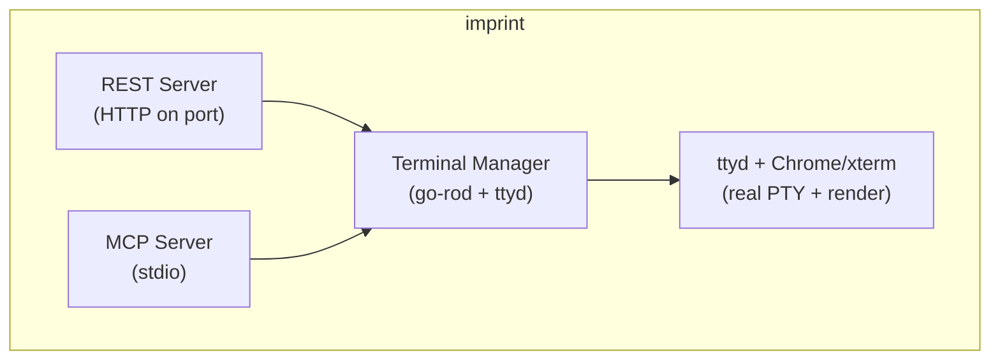

# Imprint

Agent-controllable terminal emulator with REST API and MCP server interfaces.

## Overview

Imprint provides a real terminal that AI agents can control programmatically. Agents can request a screenshot of the terminal at any time, giving them pixel-perfect visibility into exactly what a user would see.

This lets agents test like real users do—interacting with the terminal and seeing what's actually on screen, regardless of how the app was built. TUI testing becomes framework-agnostic, allowing you to test any terminal application without needing to learn or use its internal testing strategies.

**How it works:**
- **ttyd**: Web terminal daemon exposing a real PTY via WebSocket
- **go-rod**: Headless Chrome automation for keyboard input and screenshots
- **xterm.js**: Terminal emulator running in Chrome for pixel-perfect rendering

## Features

- **REST API**: HTTP endpoints for keystrokes and screenshots
- **MCP Server**: Native Claude Code integration via stdio
- **Real Terminal**: Actual shell execution, not simulation
- **Pixel-Perfect Screenshots**: Exactly what you'd see in a real terminal

## Installation

### Prerequisites

```bash
# macOS
brew install ttyd

# Chrome/Chromium is auto-downloaded by go-rod
```

### Install Imprint

```bash
go install github.com/kessler-frost/imprint/cmd/imprint@latest
```

## Usage

```bash
# Start imprint (REST on port 8080, MCP on stdio)
imprint --port 8080

# Options
imprint --help
  --port    REST API port (default: 8080)
  --shell   Shell to run (default: $SHELL)
  --rows    Terminal rows (default: 24)
  --cols    Terminal columns (default: 80)
```

## REST API

```
POST /keystroke    - Send single key (e.g., {"key": "enter"})
POST /type         - Type text (e.g., {"text": "ls -la"})
GET  /screen       - Get current screen as PNG
GET  /screen/text  - Get current screen as text
GET  /status       - Terminal status (rows, cols, ready)
POST /resize       - Resize terminal
```

### Example (Python)

```python
import requests

# Type a command
requests.post("http://localhost:8080/type", json={"text": "ls -la"})

# Press enter
requests.post("http://localhost:8080/keystroke", json={"key": "enter"})

# Get screenshot
screen = requests.get("http://localhost:8080/screen").content
with open("screen.png", "wb") as f:
    f.write(screen)
```

## MCP Server (Claude Code)

Add to your `.mcp.json`:

```json
{
  "mcpServers": {
    "imprint": {
      "command": "imprint",
      "args": ["--port", "8080"]
    }
  }
}
```

### Available Tools

- `send_keystroke` - Send a key press
- `type_text` - Type a string
- `get_screenshot` - Get screen as base64 PNG
- `get_screen_text` - Get screen as plain text
- `get_status` - Get terminal status
- `resize_terminal` - Resize the terminal

## Architecture



## License

Apache 2.0
