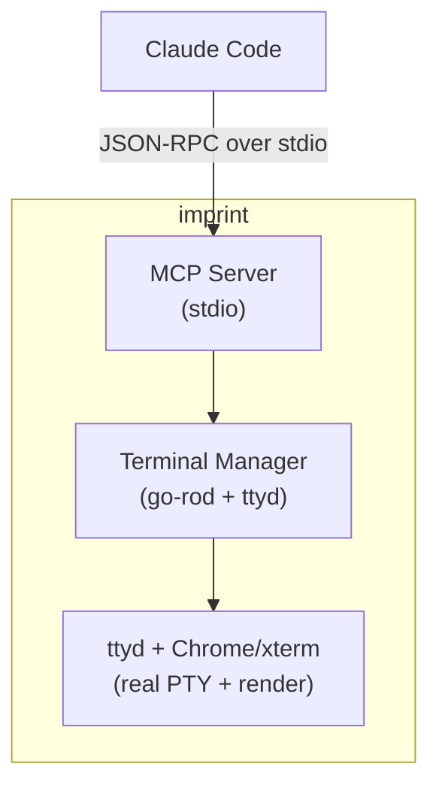

# Imprint

[](https://pkg.go.dev/github.com/kessler-frost/imprint)
[](https://goreportcard.com/report/github.com/kessler-frost/imprint)
[](LICENSE)
[](https://github.com/kessler-frost/imprint/releases)

Lets AI agents control a real terminal and see exactly what's on screen via MCP. Framework-agnostic TUI testing.

## Overview

Imprint provides a real terminal that AI agents can control programmatically. Agents can request a screenshot of the terminal at any time, giving them pixel-perfect visibility into exactly what a user would see.

This lets agents test like real users do—interacting with the terminal and seeing what's actually on screen, regardless of how the app was built. TUI testing becomes framework-agnostic, allowing you to test any terminal application without needing to learn or use its internal testing strategies.

**How it works:**
- **ttyd**: Web terminal daemon exposing a real PTY via WebSocket
- **go-rod**: Headless Chrome automation for keyboard input and screenshots
- **xterm.js**: Terminal emulator running in Chrome for pixel-perfect rendering

## Features

- **MCP Native**: Direct Claude Code integration via stdio protocol
- **Real Terminal**: Actual shell execution, not simulation
- **Pixel-Perfect Screenshots**: Exactly what you'd see in a real terminal
- **Framework Agnostic**: Test any TUI application without framework-specific tooling

## Installation

```bash
curl -fsSL https://raw.githubusercontent.com/kessler-frost/imprint/main/install.sh | sh
```

This installs imprint and its dependency ttyd (if not already installed).

### Uninstall

```bash
curl -fsSL https://raw.githubusercontent.com/kessler-frost/imprint/main/install.sh | sh -s -- --uninstall
```

### Manual Installation

If you prefer manual installation:

1. Install ttyd:
   ```bash
   # macOS
   brew install ttyd

   # Ubuntu/Debian
   sudo apt install ttyd

   # Arch Linux
   sudo pacman -S ttyd
   ```

2. Download imprint from [releases](https://github.com/kessler-frost/imprint/releases) or:
   ```bash
   go install github.com/kessler-frost/imprint/cmd/imprint@latest
   ```

## Usage

Imprint is designed to be launched by Claude Code as an MCP server. See the configuration below.

### Manual Testing

```bash
# Run imprint directly (MCP on stdio)
imprint

# Options
imprint --help
  --shell   Shell to run (default: $SHELL)
  --rows    Terminal rows (default: 24)
  --cols    Terminal columns (default: 80)
  --version Print version and exit
```

## MCP Server (Claude Code)

Add imprint as an MCP server:

```bash
claude mcp add imprint -- ~/.local/bin/imprint
```

With custom terminal size:

```bash
claude mcp add imprint -- ~/.local/bin/imprint --rows 30 --cols 120
```

### Available Tools

- `send_keystrokes` - Send key presses (e.g., `["enter"]`, `["up", "up", "enter"]`)
- `type_text` - Type a string
- `get_screenshot` - Get screen as base64 JPEG
- `get_screen_text` - Get screen as plain text
- `get_status` - Get terminal status
- `resize_terminal` - Resize the terminal
- `restart_terminal` - Restart the terminal (optionally with a new command)
- `wait_for_text` - Wait for text to appear on screen (5s default timeout)
- `wait_for_stable` - Wait for screen to stop changing (500ms stable duration)

## Examples

The `examples/` directory contains demo applications for testing imprint:

### screenshot-demo
A Bubble Tea TUI with **visual elements that require screenshot analysis**:
- **Random colors**: Colored squares randomly selected at startup - text extraction shows `████` but screenshot reveals actual colors
- **Visual bugs**: Intentional rendering issues (misaligned title, color bleed, poor contrast) that are only detectable via screenshot

This demonstrates why `get_screenshot` is valuable - some things can only be verified by actually *seeing* the terminal.

### text-demo
A simple text-based TUI using ASCII characters. Good for testing `get_screen_text` and basic keyboard navigation.

## Architecture



## License

Apache 2.0
